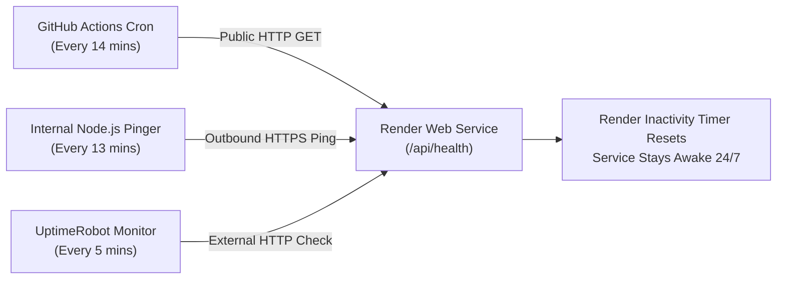

# Zero-Cost Hosting & Anti-Spin-Down Guide
### Academia–Industry Collaboration Portal

This comprehensive guide explains how to host the complete full-stack portal (React frontend + Node.js backend + MySQL database) **100% free forever**, and how to **completely eliminate Render's 15-minute inactivity spin-down (cold starts)**.

---

## Architecture Summary

| Component | Free Host | Cost | Cold Start / Spin-Down Prevention |
|---|---|---|---|
| **Backend API** | [Render Web Service](https://render.com) (Free Tier) | $0.00 | Automated Keep-Alive (GitHub Actions + Self-Pinger + UptimeRobot) |
| **Frontend UI** | Render (Unified Single Service) or GitHub Pages | $0.00 | Pre-compiled static assets served instantly |
| **MySQL Database** | [TiDB Cloud Serverless](https://tidbcloud.com) (or Aiven) | $0.00 | Always-on, 25 GB free forever, zero sleep |

---

## Part 1: Free MySQL Cloud Database Setup (TiDB Cloud)

> Render free tier only offers PostgreSQL and Redis; it does not host MySQL natively. To keep MySQL for free without credit card charges, we use **TiDB Cloud Serverless** (fully MySQL 8.0-compatible, 25 GB free forever, never sleeps).

1. Go to [tidbcloud.com](https://tidbcloud.com) and sign up with your GitHub or Google account.
2. Click **Create Cluster** -> Select **Serverless** (Free $0/month).
3. Choose your region (e.g. `us-east-1` or nearest) and click **Create**.
4. In your cluster dashboard, click **Connect**:
   - Select **Endpoint Type**: `Public`
   - Select **Connect With**: `Node.js` (or MySQL CLI)
   - Click **Generate Password** and copy the connection string or credentials.
5. TiDB provides a standard connection URI in this format:
   ```text
   mysql://<USERNAME>:<PASSWORD>@<HOST>:4000/<DATABASE_NAME>?ssl={"rejectUnauthorized":true}
   ```
6. **Initialize the Database Schema & Seed Data**:
   On your local machine, open your terminal in the project directory and run:
   ```bash
   DATABASE_URL="your_tidb_connection_string" node backend/database/seedRunner.js
   ```
   *All tables and test data will be created in your cloud database instantly.*

---

## Part 2: Deploy Backend & Frontend to Render for Free

The repository is pre-configured with a unified full-stack architecture (`render.yaml` and root `package.json`), allowing your entire website (API + React UI) to run on a single free Render Web Service.

### Deployment Steps:
1. Push your latest code to your GitHub repository:
   ```bash
   git add .
   git commit -m "feat: render deployment configuration and keep-alive automation"
   git push origin main
   ```
2. Log in to [Render](https://dashboard.render.com).
3. Click **New +** -> **Web Service**.
4. Select **Build and deploy from a Git repository** and connect your GitHub repo (`Academia-Industry-`).
5. Configure the Web Service:
   - **Name**: `academia-industry-portal` (or your choice)
   - **Region**: Oregon (US West) or closest to your database
   - **Branch**: `main` (or your active branch)
   - **Root Directory**: *(leave blank)*
   - **Runtime**: `Node`
   - **Build Command**: `npm run render-build`
   - **Start Command**: `npm start`
   - **Plan**: **Free** ($0 / month)
6. Add the following **Environment Variables** in the Render settings:
   | Key | Value | Description |
   |---|---|---|
   | `NODE_ENV` | `production` | Enables production optimizations |
   | `PORT` | `10000` | Port assigned by Render |
   | `DATABASE_URL` | `mysql://...` *(from Part 1)* | Your cloud MySQL connection string |
   | `JWT_SECRET` | *(click Generate)* | Secure token signing secret |
   | `KEEP_ALIVE_ENABLED` | `true` | Enables auto-pinger |
   | `KEEP_ALIVE_INTERVAL_MINUTES` | `13` | Frequency of keep-alive pings |
7. Click **Create Web Service**.
   Render will build the Vite frontend, install backend dependencies, and launch the service at:
   `https://academia-industry-portal.onrender.com`

---

## Part 3: Prevent Render Inactivity Spin-Down (Keep-Alive Automation)

### Why Render Spins Down:
On Render's Free tier, services automatically go to sleep (spin down to 0 instances) after **15 minutes of inactivity** (no incoming HTTP requests). When someone visits a sleeping service, it takes **50 to 90 seconds** (cold start) to wake back up.

To keep your service hot and active 24/7 at **$0 cost**, this project provides a **3-Layer Keep-Alive Defense**:



### Layer 1: Automated GitHub Actions Keep-Alive Workflow (Built-in)
The repository includes `.github/workflows/keep-alive.yml`. Every 14 minutes, GitHub's cloud servers send a request to your Render `/api/health` endpoint.

**How to activate:**
1. In your GitHub repository, navigate to **Settings** -> **Secrets and variables** -> **Actions**.
2. Click **New repository variable** (or secret):
   - **Name**: `RENDER_SERVICE_URL`
   - **Value**: `https://your-app-name.onrender.com` (your Render public URL)
3. Go to the **Actions** tab in GitHub -> select **Keep Render Web Service Alive** -> click **Run workflow** to test it once.
4. *Done!* GitHub Actions will now automatically ping your site every 14 minutes.
   *(Public GitHub repositories have unlimited free Actions minutes).*

---

### Layer 2: Built-in Node.js Self-Pinger (Automatic)
In `backend/utils/keepAlive.js`, an internal monitor detects `RENDER_EXTERNAL_URL` (injected automatically by Render). Every 13 minutes, it pings itself over HTTPS through Render's public network, continuously resetting Render's 15-minute idle counter.

---

### Layer 3: External Free Pinger (UptimeRobot - Recommended Backup)
For 100% redundancy and instant downtime email alerts:
1. Go to [uptimerobot.com](https://uptimerobot.com) and create a free account.
2. Click **Add New Monitor**:
   - **Monitor Type**: `HTTP(s)`
   - **Friendly Name**: `Academia Portal Render`
   - **URL / IP**: `https://your-app-name.onrender.com/api/health`
   - **Monitoring Interval**: `5 minutes` (or `10 minutes`)
3. Click **Create Monitor**.
4. UptimeRobot will ping your Render service around the clock, guaranteeing Render **never enters inactive mode**.

---

## Part 4: Alternative - Host Frontend Separately on GitHub Pages

If you prefer having the frontend hosted separately on GitHub Pages:
1. Set the Render backend URL in your frontend environment:
   In `frontend/.env.production`:
   ```ini
   VITE_API_URL=https://your-backend-name.onrender.com
   ```
2. Build and publish frontend:
   ```bash
   cd frontend
   npm run build
   npx gh-pages -d dist
   ```
3. Since GitHub Pages is a static CDN, the frontend **never experiences cold starts or spin-downs**. The backend remains warm using the Keep-Alive methods above.

---

## Verification & Health Check

You can verify that your backend and database are online at any time by visiting:
```text
https://your-service-name.onrender.com/api/health
```
Expected response:
```json
{
  "success": true,
  "data": {
    "status": "online",
    "timestamp": "2026-09-25T04:15:00.000Z",
    "uptimeSeconds": 1420,
    "databaseConnected": true,
    "version": "1.0.0"
  },
  "message": "Academia-Industry Collaboration Portal API is healthy"
}
```
